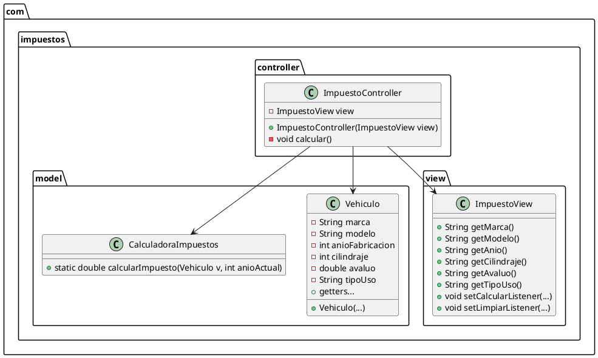

# Informe técnico - Cálculo de impuestos de un carro
## Miembros del grupo
- Luz Neidi Hinestroza Montaño - lhinest04060@universidadean.edu.co
- Soed Alejandra Rodriguez Torres - srodrigu2893@universidadean.edu.co

## Resumen
Se implementó una aplicación en Java que calcula una estimación del impuesto de un vehículo. 
El proyecto adopta el patrón MVC: Model (clases en `model`), View (Swing en `view`) y Controller (en `controller`).

## Decisiones de diseño
- **Lenguaje y librería gráfica**: Java con Swing para asegurar portabilidad y facilidad de uso en entornos de laboratorio.
- **Patrón**: MVC clásico para separar responsabilidad y facilitar pruebas y mantenimiento.
- **Reglas de negocio**: `CalculadoraImpuestos` contiene reglas de ejemplo (tarifa base 1.5%, descuentos por antigüedad, ajustes por cilindraje y tipo de uso). Estas deben actualizarse con las tarifas oficiales.
- **Validaciones**: Controlador captura `NumberFormatException` para notificar errores de ingreso de datos.

## Diagrama de clases (PlantUML)
Adjunto el archivo `diagrama_clases.puml` con el contenido PlantUML. Puede renderizarlo con una herramienta compatible (PlantUML, plugins de IDE).

